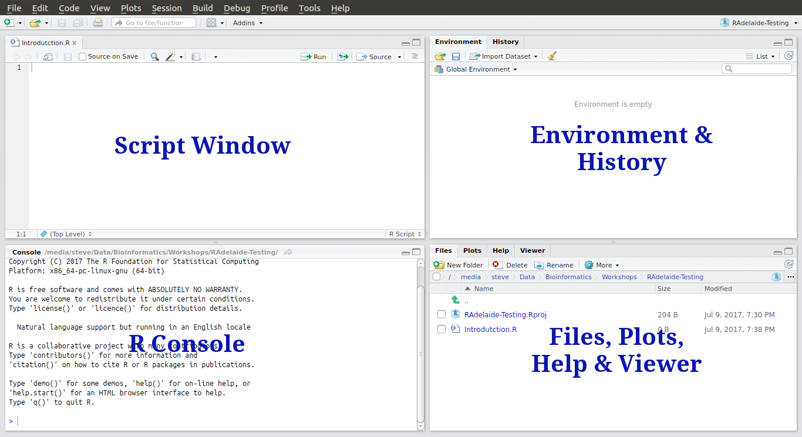

```{r setup, include=FALSE}
knitr::opts_chunk$set(echo = TRUE, include = TRUE,
											# eval = FALSE,
											# results = "hide", fig.show = "hide",
                      warning = FALSE, message = FALSE, 
                      out.width = 800, fig.align = "center")
```

## Fall Into Bioinformatics

- Intend to run every year going forward
- This one is aimed at beginners
- *Spring Into Bioinformatics* in Sept-Oct
    + Should have two streams: Beginner & Intermediate
- Organised along with BIG-SA

## Course Outline

- Day 1: R & RStudio
    - Very interactive, statistics and results
- Day 2: Bash & The Command Line
    - Large file manipulation, HPC Interaction
- Day 3: NGS Data
    - Focussed on RNA Seq this time
    - Use all skills from Days 1 & 2

## Tutors & Contributors

- Dan Kortschak, Jimmy Breen, Nathan Watson-Haigh
- Cuong To, Rick Tearle, Lloyd Low, Terry Bertozzi
- Ning Liu, Quanhui Wan, Melanie Smith, Sabrina Ng
- Paul Wang, John Toubia

## Who Am I? 

**Steve Pederson**

- Co-ordinator, Bioinformatics Hub  (University of Adelaide)
- R User for >15 years
- Short training course with Hadley Wickham
- Made countless typos and bad decisions

# R

## Why use R?

- Heavily used for analysis of biological data (along with Python)
- Handle extremely large datasets  
- Huge user base of biological researchers (www.bioconductor.org)
- Easily perform complex analytic procedures
    - Many come as inbuilt functions  
- Experience is the best teacher

## Why use R? 

- Avoids common Excel pitfalls
- Makes communicating results simple
- **Reproducible Research!!!**
    - Transparent methods
    - Code for analysis is **equivalent to a lab book**
    - Excellent integration with version control such as `git`

## What is R?

- First appeared in 1993
    - Derivative of `S` (*Chambers et al*, Bell Labs 1976)
    - **R**oss Ihaka and **R**obert Gentleman
    - Authors wrote for their own research and students
    - Now estimated >2 million users
    
## What is R?

- Open source
    - `R` is run by a volunteer community (**R Core**)
    - John Chambers is *still* a member of R Core
    - Quarterly release schedule
- RStudio is product of a **for profit** company
    - An Integrated Development Environment (IDE)
    - Employs many of the best & brightest package developers
(`tidyverse`, `bookdown`, `reticulate`, `roxygen2` etc)
    
## What is R?

- Packages are stored on CRAN (https://cran.r-project.org)
    - Packages are a collection of related functions
    - Not curated for statistical quality or documentation
- Bioconductor is a secondary repository (https://www.bioconductor.org)
    - Packages have a biological/genomics focus
    - Curated for consistency & documentation
   
## Where is R used?

- Used by Google, ATO, Trump etc
- Very large community of users in finance (Dirk Eddelbuettel - `Rcpp`)
- Genomics & Ecological Research
- Strong integration with HPC systems like Amazon, Hadoop
- Growing Machine Learning capacity
- Even has it's own peer-reviewed Journal (The R Journal)

## Using R

>__With great power comes great responsibility - Uncle Ben__
  
To use `R` we need to understand a little about:  

1. Data Types  
2. Data Structures  

## Using R

Today we will start with:

1. An Introduction to `RStudio`
2. Reading data into `R`
3. Manipulating and cleaning data
4. Visualising data
5. Writing reports using `RMarkdown`

## Using R

By the end of the day, we'll be able to

1. Load tabular data (.csv and other 'Excel-type' formats)
2. Clean up datasets
3. Edit data after loading
4. Make amazing looking plots
5. Send reports to collaborators made directly from our code

# Introduction to RStudio

## Introduction to RStudio

- `R` and `RStudio` are two separate but connected things
    + `R` is like the engine of your car
    + `RStudio` is the 'cabin' we use to interact with the engine
    + `RStudio` even comes with extra flashy features not related to `R` 
- `R` does all the calculations, manages the data, generates plots
- `RStudio` helps manage our code, displays the plots plus more

## What is RStudio | Some very helpful features of `RStudio`

- We can write scripts and **execute code** interactively
- Auto-completion by hitting the `<tab>` key
- Use of `R Projects` to manage code/data for each project/analysis
- We can see **everything** we need (directories, plots, code, history etc.)
- Integration with markdown, $\LaTeX$, bash, python, C++, version control software etc.


## Before we start | Create an R Project

(There is no need to save your R workspace if asked)

1. `File` > `New Project` > `New Directory` > `New Project`
    + Enter `R_Training` as the project name (check capitals & underscores)
    + `Create Project`
2. `New Folder` then name it `data`


## R Projects

- `R Projects` are simply a wrapper for keeping an analysis organised
    - You can easily navigate to a directory with all scripts and data
- The `R Project` name will **always** be the directory name
- Not essential, but are *good practice* and *extremely useful*


## RStudio

1. `File` > `New File` > `R Script`
2. Save As `Introduction.R`

## RStudio

```{r, echo = FALSE, include=TRUE, results='asis', fig.show='asis', out.width=900}

```


## The Script Window

- This is just a text editor.
- We enter our commands here but they are not executed
    - We can keep a record of __everything__ we've done
    - We can also add comments to our code
    - Comments start with the `#` symbol
- We'll return here later

## The Script Window

```{r, echo = FALSE, include=TRUE, results='asis', fig.show='asis', out.width=900}

```


## The R Console

- Where we execute commands $\implies$ is essentially the _"engine"_
- We can execute commands directly in the `Console` 

```{r}
1 + 1
2 * 2
```

## The R Console

As well as performing simple calculations:

- `R` has what we call an `Environment` (i.e. a Workspace)
- We can define objects here, or import data
   - Like a workbook in Excel, but **much more** flexible & powerful
   - Don't need all those empty rows & columns like Excel 
- `R` performs calculations & runs processes on these objects

## The R Environment | Creating an `R` object

- We need to give it a name, and some data
    - Like naming a spreadsheet in Excel (e.g. `Sheet1`)
- The process looks like `nameOfObject <- data`
    - The `<-` symbol is like an arrow
    - Tells `R` to put the `data` **in the object**
    
## The R Environment 

In the Console type:

```{r}
x <- 5
```

- We have just defined an object called `x`
- View the contents of the object `x` by entering it's name directly in the `Console`, or by calling `print()`

```{r, echo=TRUE, include=TRUE, results='hide'}
x
print(x)
```

## The R Environment

__Where have we created the object `x`?__

- Is it on your hard drive somewhere?
- Is it in a file somewhere?

## The R Environment

- We have placed `x` in our `R Workspace`
- More formally known as your `Global Environment`

```{r, echo=FALSE, include=TRUE, out.width=600}
knitr::include_graphics("../images/EnvironmentTab.png")
```


## The R Environment

- The `Environment` is like your desktop
- We keep all our relevant objects here and can save all the objects in your workspace as an `.RData` object

```{r, eval=FALSE, echo=TRUE, include=TRUE}
save.image()
```


## The R Environment

Once an object is in the `Environment` we can perform calculations on it

```{r}
1 + x
x^2
```

#### NB: R is *case sensitive*

## The R Environment: Functions

`R` has a series of inbuilt functions, e.g. `sqrt()`, `log()`, `max()`, `min()` etc.

- We place an object or value inside the `()` after the name of a function

```{r}
sqrt(x)
log(x)
```

## The R Environment: Functions

- Many inbuilt functions are organised into a package called `base`
    - Always installed with `R`
    - Packages group similar/related functions together
    
```{r, eval=FALSE}
?base
```

- This will take you to the `Help` pane
    - Click on the underlined word `Index` at the bottom for a list of functions in the `base` packages
    
## Vectors: A Sneak Peek

- Instead of a single value, we can give an `R` object multiple values
- Known as a **vector** $\implies$ like a column in Excel
- `R` requires all elements of a vector to be *the same type*

```{r}
x <- 1:5
x
length(x)
```

## Vectors: A Sneak Peek

Functions & calculations work on the entire vector

```{r, eval=FALSE}
x + 1
x^2
sqrt(x)
max(x)
sum(x)
mean(x)
sd(x)
```

    
# The Script Window

## RStudio: The Script Window

Best practice for all analysis is to enter our code in the Script Window

- This is a plain text editor $\implies$ `RStudio` will:
    - highlight syntax for us
    - help manage indenting
    - enable auto-completion (it can be slower than your typing)
- Enter code in this window and *send it to the R Console*    
- We save this file as a record of what we've done

## RStudio: The Script Window

- We can write comments by starting a line with the `#`
    - Anything following this symbol will not be executed
    - Can write notes to ourselves and collaborators
    - We can also place this at the end of a line with a comment
- Enter the following in the Script Window (but don't do anything else)

```{r}
# Create an object called x
x <- 5
```

## RStudio: The Script Window


```{r}
# Create an object called x
x <- 5
```

To send this to the Console:

- Place the cursor on a line then `Ctrl+Enter` (`Cmd+Enter` on MacOS), or
- Select the lines using the mouse then `Ctrl+Enter` (or `Cmd+Enter`)
- Or after selecting one or more lines you can click the `Run` button
    - Be careful to select all the correct text though...

## RStudio: The Script Window

As well as creating objects, we can use this to write general code

```{r}
# I'm not sure. Is x greater than zero?
x > 0
```

Including comments describing your intention, is **highly advisable**


## RStudio: Tab Auto-completion

`RStudio` will give us suggestions when we ask it to.

- In either the Console or Script Window type `?bas` then hit the `<tab>` key
    - A whole lot of options will appear
    - Very handy with long variable/function names
    - If you can't quite remember the spelling
    - Sometimes completes when you don't want it to


# RStudio | Other Tabs and Features

## RStudio: Other Tabs and Features

- Next to the `Environment` Tab is the `History` Tab
    - Contains everything executed in the `Console`
    - Useful for when we've been lazy

**Best coding practice is to enter code in the `Script Window` and execute**

## RStudio: Other Tabs and Features

In the bottom right are a series of tabs

1. `Files`: This shows your current working directory
2. `Plots`: Every time you make a graph it appears here
3. `Packages`: __NEVER CLICK OR UN-CLICK ANYTHING HERE__
4. `Help`: We all use this a lot!


## RStudio: Other Tabs and Features

- Every tab can be resized using the buttons on the top right
- Window separators can also be be moved

## RStudio: Cheatsheet and Shortcuts

`Help > Cheatsheets > RStudio IDE Cheat Sheet`

Page 2 has lots of hints:

- `Ctrl + 1` places focus on the Script Window
- `Ctrl + 2` places focus on the Console
- `Ctrl + 3` places focus on the Help Tab


---

<div class="footer" style="text-align:center;width:25%">
[Home](../index)
</div>
