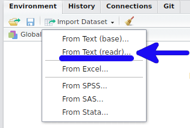
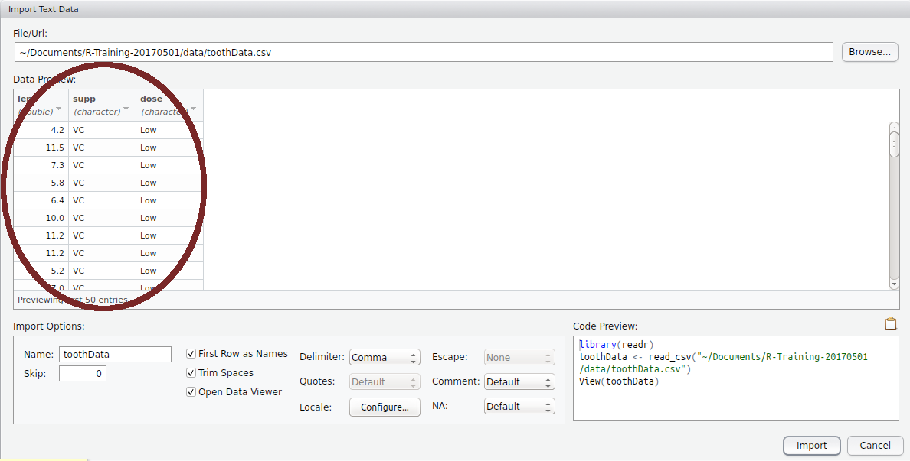
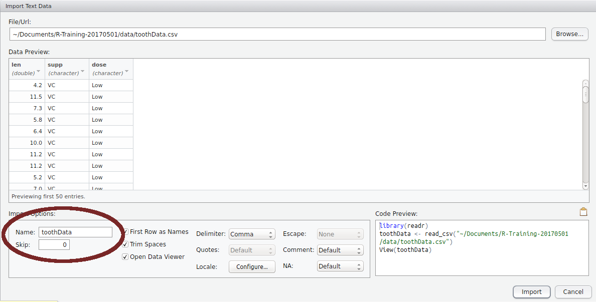

```{r, loadPackages, echo = FALSE, include = FALSE}
library(knitr)
opts_chunk$set(echo = TRUE, include = TRUE, 
               warning = FALSE, message = FALSE, 
               out.width = 800, fig.align = "center")
```

# Getting Data Into R

## Importing Data

- A point of confusion for many learning `R` are the errors, messages & warnings
    - We often see them while we're loading data
    - Some are actually helpful messages
- A knowledge of data types is beneficial when using `R`
    - `logical`, `integer`, `numeric`, `character`
- We can load `xlsx`, `xls`, `csv`, `txt`, files + many more


## Importing Data

- Things we do to make it "look nice" in Excel can create problems:
    - Blank rows are not fatal, just annoying
    - Cell formatting will not be imported
    - Mixtures of numbers and text
    - Plots will not be imported
    - Deleted cells are sometimes imported as blank rows/columns
    
## Importing Data

First let's get the data for this exercise.

- Data for all three days is on your VM in the folder `/home/trainee/data`.
- It's dynamically linked to the source, so please don't anything edit in this folder
- Select everything in `~/data/intro_r` and `Copy To` `~/R_Training/data`

## Importing Data

- In `data` you'll see a set of `csv` and other excel-type files we've copied
- Select `toothData.csv` and click `More > Export...` 
- Save in your Downloads folder and open with Excel (or Libre Office)

## Importing Data

- This is actually the type of format `R` loves to see
- Simple column structure, with column names
- No blank rows at the top or separating sub-tables
- No blank columns

## Previewing in RStudio

1. Close Excel and go back to RStudio
2. Make sure you're in the `data` directory
3. Click on `toothData.csv` 
4. Select `View File`

This will open a preview in the Script Window (close when you're done)

## Before We Go On

1. `File` > `New File` > `R Script` (Or `Ctrl+Shift+N`)
2. Save as `DataImport.R`
3. Enter this line at the top of the script

```{r}
library(tidyverse)
```

## Before We Go On

```{r}
library(tidyverse)
```

- The tidyverse is a collection of connected packages
- A package contains a set of functions for related tasks
- We've already seen `min()`, `max()` etc from `base`
- This command loads a core set:
    - `readr`, `dplyr`, `tibble`, `ggplot2`, `tidyr` and `purrr`

# Import Using the GUI

## Using the GUI To Load Data

To import into our `R Environment` we can either:

1. Click on the file and choose `Import Dataset`, or
2. Use the button as shown in the `Environment` Tab

 **Stop and wait until we're all ready**


## The Preview Window {.smaller}

```{r, echo=FALSE, out.width=900}
include_graphics("../images/importGUI.png")
```

(Click `Update` if you don't see this)

## The Preview Window

```{r, echo=FALSE, out.width='900mm', fig.align='center'}

```

## The Preview Window

```{r, echo=FALSE, out.width='900mm', fig.align='center'}
knitr::include_graphics("../images/importGUI_code.png")
```

## The Preview Window

1. Select and copy all the code in the `Code Preview` Box
2. Click `Import`
3. Magic happens...
    + Ignore the red/blue text. This is just helpful information
4. **Paste the copied code into your script, directly below `library(tidyverse)`**

## What has just happened? 

The code we copied has 3 lines:

```1. library(readr)```

- This package contains the function `read_csv()`
- Is already loaded by default with `library(tidyverse)`
    + We don't strictly need this line today
    + It won't cause any problems though
    
## What has just happened? 

The code we copied has 3 lines:

```
1. library(readr)
2. toothData <- read_csv("data/toothData.csv")
```

- This is the code which loads the data into your `R Environment`
- It created an object named `toothData` by using the file name.
    
## What has just happened?

```{r, echo=FALSE, out.width='950mm', fig.align='center'}

```

## What has just happened?

1. `library(readr)`
2. `toothData <- read_csv("data/toothData.csv")`
3. `View(toothData)`
    + Opens a preview in a familiar `Excel-like` format
    + I **never** use this

Close the preview by clicking the cross and delete the line `View(toothData)`
    
## What has just happened?

- We have just loaded data using the default settings of `read_csv()`
- Now we've saved the code in our script, **we don't need the GUI for this operation again!**

## Let's Demonstrate

1. In the `Environment Tab` click the broom icon ()
    + This will delete everything from your `R Environment`
    + It won't unload the packages
2. Select the code we've just pasted and send it to the console
    + (Reloading the packages won't hurt)
3. Check the `Environment Tab` again and `toothData` is back


## A Brief Side Note

- `RStudio` now uses `read_csv()` from the package `readr` by default
- Old scripts will often use `read.csv()` from the package `utils`
- The newer version is slightly faster and fails less
- It also gives informative messages
- Other functions in `utils` are `read.delim()` and `read.table()`
- `readr` has the functions `read_tsv()`, `read_delim()` and `read_table()` etc.

## The advantage of `readr` over `utils`

- `R` has it's origins in statistical analysis
    - Categorical variables are very common
    - Original data import functions **assume text is categorical data**
    - Called `factors` in `R` $\implies$ more memory efficient
- `readr` import functions **do not assume this**  
(`read_csv()`, `read_tsv()` etc)

## Data Frame Objects

- The object `toothData` is known as a `data.frame`
- `R` equivalent to a spreadsheet
- `readr` uses a variant called a `tibble` (originally `tbl_df`)
    + Like a `data.frame` with pretty bows & ribbons
    + Also named after an SQL `table`
    + **Can only have row numbers as the row names**
    
I will be lazy and call this a data frame as the differences are so trivial

## Data Frame Objects

- Some additional ways to inspect this are:

```{r,eval=FALSE}
toothData
print(toothData)
head(toothData)
glimpse(toothData)
```

**What were the differences between each method?**

## Data Frame Objects

- Each column is a vector
    + **Must contain data of the same type**
- Each column must be the same length
- We can access each column by typing the column name after a `$`

```{r,eval=FALSE}
toothData$len
```

## Data Frame Objects

- We can grab columns and rows using square brackets `[]`
    + rows *before* the comma, columns *after* the comma

```{r,eval=FALSE}
toothData[1:3, ]
tootehData[,"len"]
```

- All `data.frame`/`tibble` objects must have column names.

## Understanding `read_csv()`

- In the above we called the `R` function `read_csv()`
- Check the help page

```{r, eval = FALSE}
?read_csv
```

- We have four functions but stick to `read_csv()`

## Understanding `read_csv()` 

```
read_csv(file, col_names = TRUE, col_types = NULL,
  locale = default_locale(), na = c("", "NA"), quoted_na = TRUE,
  quote = "\"", comment = "", trim_ws = TRUE, skip = 0, 
  n_max = Inf, guess_max = min(1000, n_max), 
  progress = show_progress())
```

- This function has numerous *arguments* (`file`, `col_names` etc.)
- If only the argument name is given(e.g. `file`) we need to specify something


## Understanding `read_csv()` 

```
read_csv(file, col_names = TRUE, col_types = NULL,
  locale = default_locale(), na = c("", "NA"), quoted_na = TRUE,
  quote = "\"", comment = "", trim_ws = TRUE, skip = 0, 
  n_max = Inf, guess_max = min(1000, n_max), 
  progress = show_progress())
```

- Otherwise the argument is given a default value (e.g. `col_names = TRUE`)
- **If specifying in order, we don't need to name arguments**  
(I like to name them though)

## Understanding `read_csv()`

```{r, eval=FALSE}
toothData <- read_csv("data/toothData.csv")
```

Is equivalent to:

```{r, eval=FALSE}
toothData <- read_csv(file = "data/toothData.csv")
```

## Understanding `read_csv()`

All `arguments` for the function were defined somewhere in the GUI.

1. Open the GUI Preview by clicking on the file again
2. Uncheck the `First Row as Names` checkbox


## Understanding `read_csv()`

All `arguments` for the function were defined somewhere in the GUI.

1. Open the GUI Preview by clicking on the file again
2. Uncheck the `First Row as Names` checkbox
    + *What happened to the code?*
    + *How did the columns change?*


## Reading Help Pages: Bonus Slide

- The bottom three functions are simplified wrappers to `read_delim()`
- `read_csv()` calls `read_delim()` using `delim = ","`
- `read_csv2()` calls `read_delim()` using `delim = ";"`
- `read_tsv()` calls `read_delim()` using `delim = "\t"`

<br>
__What function would we call for *space-delimited* files?__

## Loading Excel Files

`R` also has a package for loading `.xls` and `xlsx` files.

```{r}
library(readxl)
```

The main function is `read_excel()`

```{r, eval=FALSE}
?read_excel
```

## Bonus Challenge

Export `RealTimeData.xlsx` from your `data` folder to your local machine and inspect

__Try to load each of the sheets from `RealTimeData.xslx`__

(Remember to call the `R` objects something different)

__Do you get any weird behaviour for sheet 3?__

__How could we load these two separate tables?__

---

<div class="footer" style="text-align:center;width:25%">
[Home](http://uofabioinformaticshub.github.io/Intro_R_FIB_2019/)
</div>
