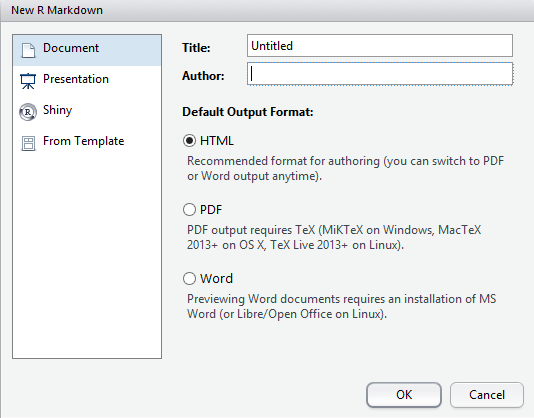

```{r, echo=FALSE, message=FALSE}
library(knitr)
library(tidyverse)
opts_chunk$set(message = FALSE)
```


# R Markdown

## Writing Reports Using `rmarkdown`

* `rmarkdown` is a cohesive way to
    + Load & tidy data 
    + Analyse data, including figures & tables
    + Publish everything in a complete report/analysis
* Everything is one document, with our analysis code embedded alongside our results
* The package `knitr` is the engine behind this

## Writing Reports Using `rmarkdown`

We can output our analysis directly as:

* HTML
* MS Word Documents
* PDF Documents (If you have $\LaTeX$ installed)
* Slidy or `ioslides` presentations

We never need to use MS Word, Excel or Powerpoint again!

## Writing Reports Using `rmarkdown`

- The file suffix is `.Rmd`
- Include normal text *alongside embedded `R` code.*
- Create all of our figures & tables directly from the data
- Data, experimental and analytic descriptions
- Mathematical/Statistical equations
- Nicely Formatted Results
- Any other information

## Creating an *R* Markdown document

Let's create our first `rmarkdown` document

1. Go to the `File` drop-down menu in RStudio
2. New File -> R Markdown...

## Creating an *R* Markdown document

```{r, echo=FALSE, out.width = 534, fig.align = "center", results='asis'}

```

## Creating an *R* Markdown document

1. Change the Title to: My First Report
2. Change the Author to *your own name*
3. Leave everything else as it is & hit OK
4. Save the file as `RMarkdownTutorial.Rmd`

## Looking at the file automatically created

A *header section* is contained between the `---` lines at the top

- __Nothing can be placed before this!__
- Uses YAML (**Y**AML **A**in't **M**arkup **L**anguage)
- Editing is beyond the scope of this course
- Can set custom `.css` files, load LaTeX packages, set parameters etc.

## Looking at the file automatically created

Lines 8 to 10 are a code `chunk`

- Chunks always begin with ```{r}
- Chunks always end with ```
- Executed `R` code goes between these two delineators
- Chunk names are optional and directly follow the `r`
- Other parameters are set here, e.g. do we show/hide the code

## Looking at the file automatically created

Line 12 is a Subsection Heading, starting with `##`

- Click the _staggered text_ symbol in the top-right of the Script Window to open the _document outline_ 


- Chunk names are shown in _italics_
- Section Names in plain text

## Getting Help

Check the help for a guide to the syntax.

`Help > Markdown Quick Reference`

- Increasing numbers of `#` gives Section `->` Subsection `->` Subsubsection etc.
- **Bold** is set by \*\*Knit\*\* (or \_\_Knit\_\_)
- *Italics* can be set using a single asterisk/underline: \*Italics\* or \_Italics\_
- `Typewriter font` is set using a single backtick \`Typewriter\`


## Compiling The Report

The default format is an `html_document` & we can change this later.
Generate the default document by clicking `Knit`

```{r, echo=FALSE, fig.show='asis', out.width = 600, results='asis', fig.align = "center"}

```

## Compiling The Report

The Viewer Pane will appear with the compiled report (probably)

- Note the hyperlink to the RMarkdown website & the bold typeface for the word **Knit**
- The *R* code and the results are printed for `summary(cars)`
- The plot of `temperature` Vs. `pressure` has been embedded
- The code for the plot was hidden using `echo = FALSE`

## Compiling The Report
    
- We could also export this as an MS Word document by clicking the small 'down' arrow next to the word Knit.
- By default, this will be Read-Only, but can be helpful for sharing with collaborators.
- Saving as a `.PDF` may require an installation of $\LaTeX$, so we'll ignore that for now.

## Making our own report

Now we can modify the code to create our own analysis.

- Delete everything in your R Markdown file EXCEPT the header
- We'll analyse the `PlantGrowth` dataset which comes with `R`
- First we'll need to describe the data

```{r, eval=FALSE}
?PlantGrowth
```

## Rename the report

First we should change the title of the report to something suitable, e.g. *The Effects of Two Herbicide Treatments on Plant Growth*

## Create a "Data Description" Section

Now let's add a section header for our analysis to start the report

1. Type `# Data Description` after the header and after leaving a blank line
2. Use your own words to describe the data

## Create a ``Data Description" Section

My example text:

> Plants were treated with two different herbicides and the effects on growth were compared using the dried weight of the plants after one month.
Both treatments were compared to a control group of plants which were not treated with any herbicide.
Each group contained 10 plants, giving a total of 30 plants.

## Create a ``Data Description" Section

Hopefully you mentioned that there were 10 plants in each group, with a total of 30.

__Can we get that information from the data itself?__

## Create a ``Data Description" Section

We know that the code `nrow(PlantGrowth)` would give the total number of samples.
__We can embed this in our data description!__

1. Instead of the number 30 in your description, enter  \``r` `nrow(PlantGrowth)`\`
2. Compile the HTML document.

## Loading *R* packages

1. Before the Data Description header, add a new header called `Setup`
2. Create a code chunk with the contents `library(tidyverse)`.
3. Recompile the HTML

**Hint: You can create an empty code chunk using** `Ctrl+Alt+I`

This has loaded the `tidyverse` packages for the whole document.
All subsequent code chunks can use any functions in the package.

## Loading *R* packages

Notice that this gave us an overly informative message.
We can turn this off:

1. After the `r` at the start of the code chunk, add a comma
2. Start typing the word `message` and use the auto-complete feature to set `message = FALSE`
3. Recompile

## Writing the Report

After our description, we could also have a look at the data in a summary.
Add the following in a code chunk.

```{r, eval=FALSE}
PlantGrowth %>% 
  group_by(group) %>% 
  summarise(n = n(),
            Mean = mean(weight)) 
```

(Recompile...)

## Formatting Tables

To change this table into a nicely formatted one:

1. Load `pander` into the workspace
2. Use the function `pander`

In the `Setup` section, on the line after loading `tidyverse` enter:

```{r}
library(pander)
```

## Formatting Tables

Then head back to the code chunk and add the following.

```{r, eval=FALSE}
PlantGrowth %>% 
  group_by(group) %>% 
  summarise(n = n(),
            Mean = mean(weight)) %>%
  pander(caption = "Sample Sizes and average weights for each group")
```

(Recompile...)

## Using `pander`

The package `pander` is great for formatting `R` output.

Add the following line to your data description:

> "The three groups are classified as \``r` `pander(levels(PlantGrowth$group))`\`"

(We'll explain this bit of code tomorrow)

## Add a plot of the data

1. Create a plot using `geom_boxplot()`
2. Fill the boxes based on the `group` variable


```{r, echo =FALSE, include=TRUE, results='asis', fig.show='asis', fig.align='center', fig.height=4, fig.width=5}
ggplot(PlantGrowth, aes(x = group, y = weight, fill = group)) +
  geom_boxplot() +
  theme_bw() +
  labs(x = "Treatment Group", y = "Dried Weight (g)")
```

## Analyse the data

Here we can fit a simple linear regression using:

- `weight` as the response variable
- `group` as the predictor variable

To fit a linear model in `R`:

1. Use the function `lm()`
2. Save the results as a new object

## Analyse the data

```{r}
model_fit <- lm(weight ~ group, data = PlantGrowth)
```

We can view the `summary()` or `anova()` for a given model using

```{r}
anova(model_fit)
summary(model_fit)
```

## Analyse the data

To place these as formatted tables in the text we can use `pander()`

```{r, eval=FALSE}
model_fit %>% anova() %>% pander()
```


```{r, eval=FALSE}
model_fit %>% summary() %>% pander()
```

You can change the default captions if you like

## Add Some Diagnostic Plots

```{r, eval=FALSE}
plot(model_fit, which = 1)
plot(model_fit, which = 2)
```

In the chunk header add:  
`echo=FALSE, fig.show='hold', fig.width = 6, fig.cap = "Diagnostic plots for model fit"`

(Try using tab auto-complete to speed that up)

## Finishing the analysis

After you're happy with the way your analysis looks

- A good habit is to finish with a section called `Session Info`
- Add a code chunk which calls the *R* command `sessionInfo()`

So far we've been compiling everything as HTML, but let's switch to an MS Word document.
We could email this to our supervisors, or upload to Google docs for collaborators...

## Summary

This basic process is incredibly useful

- We never need to cut & paste anything between R and other documents
- Every piece of information comes directly from our *R* analysis
- We can very easily incorporate new data as it arrives
- Creates *reproducible research*
- Highly compatible with collaborative analysis & version control (Git)

---

<div class="footer" style="text-align:center;width:25%">
[Home](http://uofabioinformaticshub.github.io/Intro_R_FIB_2019/)
</div>